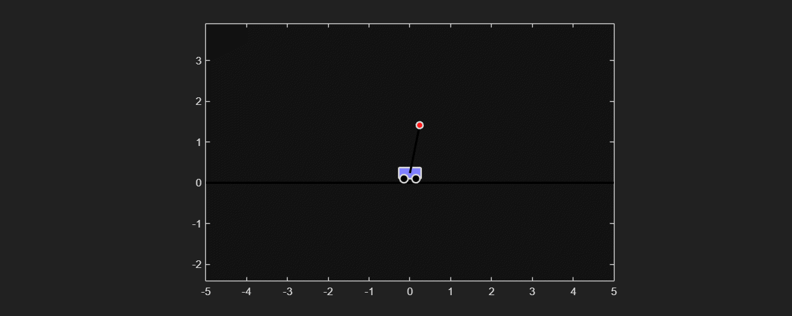
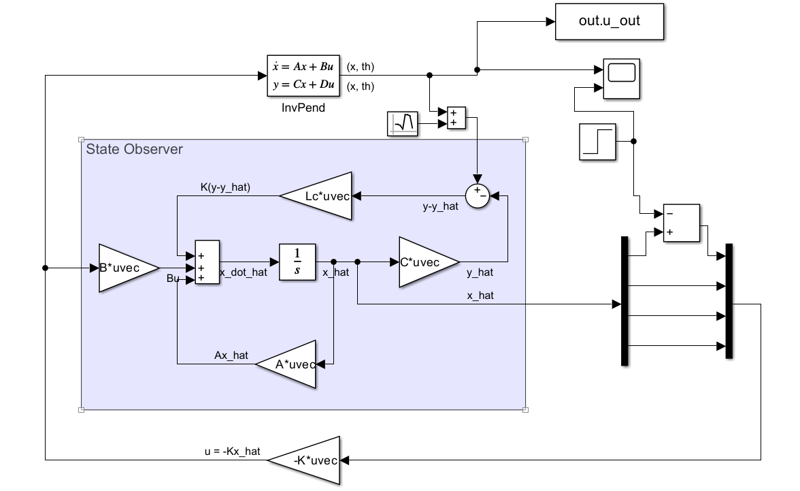

# InvPend-Control


# 🤖 Inverted Pendulum Control with LQR & State Observer 📈

[](https://opensource.org/licenses/MIT)

This project provides a complete **MATLAB & Simulink** implementation for stabilizing an inverted pendulum on a cart. The control system uses a **Linear-Quadratic Regulator (LQR)** for optimal state feedback and a **Luenberger State Observer** to estimate the system's states in real-time.

The goal is to demonstrate a classic output-feedback control problem where not all states are directly measured, requiring an observer to reconstruct the full state vector for the controller. The result is a robust system capable of balancing the pendulum from a perturbed initial condition.

---

## 🚀 Demonstration

The controller successfully stabilizes the pendulum in its unstable upright equilibrium (`theta = 0`) and holds the cart's position at `x = 0`. The animation below shows the system recovering from an initial angle of 0.2 radians.

| LQR Controller with State Observer in Action |
| :------------------------------------------: |
|  |

*Note: You must run the code to generate `pendulum_animation.gif`.*

---

## 🔧 System Architecture & Control Strategy

The entire control system is built around a state-space model and is visualized in the Simulink diagram below. The controller (`u = -Kx̂`) does not have access to the true state `x` from the plant; it only receives the estimated state `x̂` from the observer.


*<p align="center">Figure: Simulink model showing the Plant (InvPend), the State Observer, and the LQR gain.</p>*

The control pipeline consists of four key components:

1.  **State-Space Model:** The physical system is linearized around its upright equilibrium and represented by the standard state-space equations `ẋ = Ax + Bu` and `y = Cx + Du`. The state vector is `x = [position, velocity, angle, angular_velocity]`.

2.  **LQR Controller Design:** We assume we have access to the full state `x` to design an optimal state-feedback controller `u = -Kx`. The gain `K` is calculated using the **Linear-Quadratic Regulator (LQR)** algorithm, which minimizes a cost function balancing state deviation (penalized by `Q`) and control effort (penalized by `R`).

3.  **State Observer Design:** Since we cannot measure all states (e.g., velocities) in a real system, a **Luenberger Observer** is designed to estimate the state vector. It uses a copy of the system model and corrects its estimate `x̂` based on the measurement error `(y - ŷ)`, where `ŷ` is the estimated output. The observer gain `Lc` is calculated via **pole placement** to ensure the estimation error converges to zero faster than the system's own dynamics.

4.  **Output-Feedback Implementation:** The controller and observer are combined. The final control law uses the *estimated state* from the observer: **`u = -Kx̂`**. This forms a robust and practical control system that relies only on measurable outputs.

---

## ▶️ How to Run

1.  **Clone or Download:** Get the project files onto your local machine.
2.  **Requirements:** Ensure you have **MATLAB**, **Simulink**, and the **Control System Toolbox**.
3.  **Run the Setup Script:** Open MATLAB, navigate to the project folder, and run the main script (e.g., `main.m`).
    ```matlab
    % In the MATLAB Command Window
    >> main.m
    >> % open simulink and run StateObserv_StateFeedback.slx
    ```
4.  **Done!** The script will:
    -   Initialize all physical parameters (`M`, `m`, `L`, etc.).
    -   Calculate the LQR gain `K` and observer gain `Lc`.
    -   Run the Simulink simulation.
    -   Generate a live animation in a figure window.
    -   Automatically save the animation as `pendulum_animation.gif` in the project folder.

---

## ⚙️ Customization & Parameters

All key parameters can be easily modified in the main setup script.

-   **Physical Properties:**
    -   `M`: Mass of the cart
    -   `m`: Mass of the pendulum
    -   `L`: Length of the pendulum rod
-   **LQR Tuning:**
    -   `Q`: The state-cost matrix. Increase values to make the controller more aggressive in correcting deviations for specific states.
    -   `R`: The control-cost value. Increase to reduce the amount of force `u` the controller is allowed to use, resulting in smoother but potentially slower control.
-   **Observer Tuning:**
    -   `observer_poles`: The desired poles for the observer. The observer is typically designed to be 2-5 times faster than the controller poles (`eig(A-B*K)`).

---

## 📄 License

This project is licensed under the MIT License.
